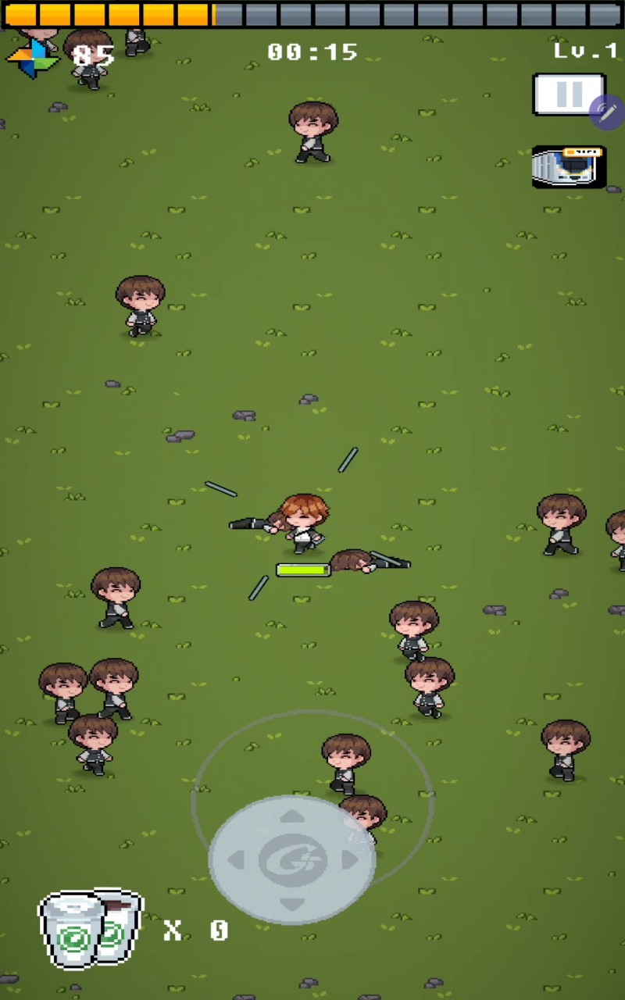
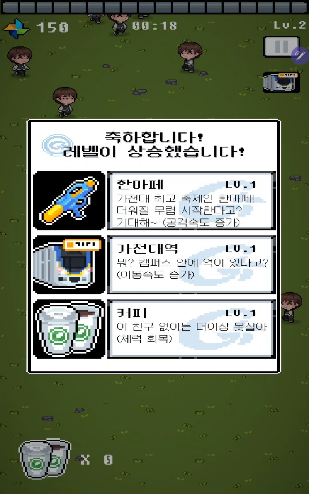

# RunFreshman-

<strong>도망가 새내기!</strong>

  가천대학교 학생들을 위해 만든 Unity 기반 모바일 생존 액션 게임

  
  
  

## 프로젝트 소개

`RunFreshman-`은 몰려오는 적을 피해 성장하고, 제한 시간 이후 등장하는 보스를 상대하는 모바일 생존 액션 게임입니다.  
이 저장소에는 실제 게임 플레이 루프와 캐릭터 성장, 보스 패턴, 로그인/랭킹/업적 등 핵심 기능을 담당하는 C# 스크립트가 정리되어 있습니다.

## 핵심 게임 루프

- 4종 캐릭터가 서로 다른 이동/공격 속성으로 플레이 스타일이 나뉩니다.
- 전투 중 경험치를 모아 레벨업하고, 매번 3개의 성장 선택지 중 하나를 고르는 구조입니다.
- 근접/원거리 무기, 장비, 회복 아이템이 조합되며 캐릭터 타입에 따라 등장 풀이 달라집니다.
- 약 8분 생존 시 보스 페이즈가 시작되고, 경고 연출 후 전용 패턴 전투가 전개됩니다.
- 최종 점수를 기준으로 개인 최고 기록과 랭킹이 갱신됩니다.

## 코드 기준 구현 포인트

| 영역 | 구현 내용 |
| --- | --- |
| `InGame/Manager` | 게임 상태 관리, 일시정지, 결과 화면, 오디오, 보스 연출 |
| `InGame/Spawn` | 시간 기반 난이도 상승, 가중치 기반 적 스폰 |
| `InGame/Weapon` | 근접 회전 무기, 원거리 자동 조준 발사, 장비 강화 |
| `InGame/Enemy` | 일반 적 추적 AI, 보스 이동 및 4종 공격 패턴 |
| `InGame/UI` | HUD, 레벨업 선택 UI, 결과 UI |
| `Backend/Login` | 회원가입, 로그인, 닉네임/이메일 처리 |
| `Backend/Backend` | 뒤끝 초기화, 점수 저장, 개인 최고 점수 반영, 랭킹 조회 |
| `InGame/Manager/AchiveManager.cs` | 업적 달성에 따른 캐릭터 잠금 해제 처리 |

## 인상적인 구현 요소
- `PoolManager`를 활용해 탄환/적 프리팹을 재사용하는 오브젝트 풀링 구조
- `Spawner`에서 로그 + 선형 증가 공식을 함께 사용한 난이도 스케일링
- 캐릭터 타입에 따라 무기/레벨업 선택지를 다르게 제공하는 성장 분기
- 보스 등장 시 카메라 흔들림, 경고 UI, 패턴 전환을 포함한 페이즈 연출
- 뒤끝 기반 커스텀 로그인, 닉네임 검증, 개인 랭킹 및 상위 50위 랭킹 로드

## 사용 스택

| 구분 | 내용 |
| --- | --- |
| Language | C# |
| Engine | Unity |
| Client Systems | Unity Input System, Cinemachine, UI |
| Backend | 뒤끝(BackEnd) |

## 미리보기

| Title | In Game |
| --- | --- |
|  |   |

## 게임 플레이 영상

[YouTube에서 플레이 영상 보기](https://www.youtube.com/watch?v=dCK3hiYxu-w)

